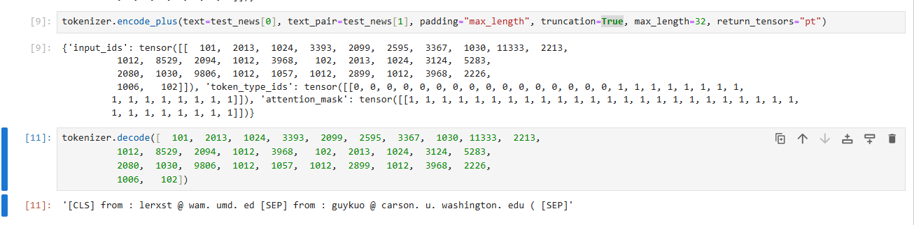
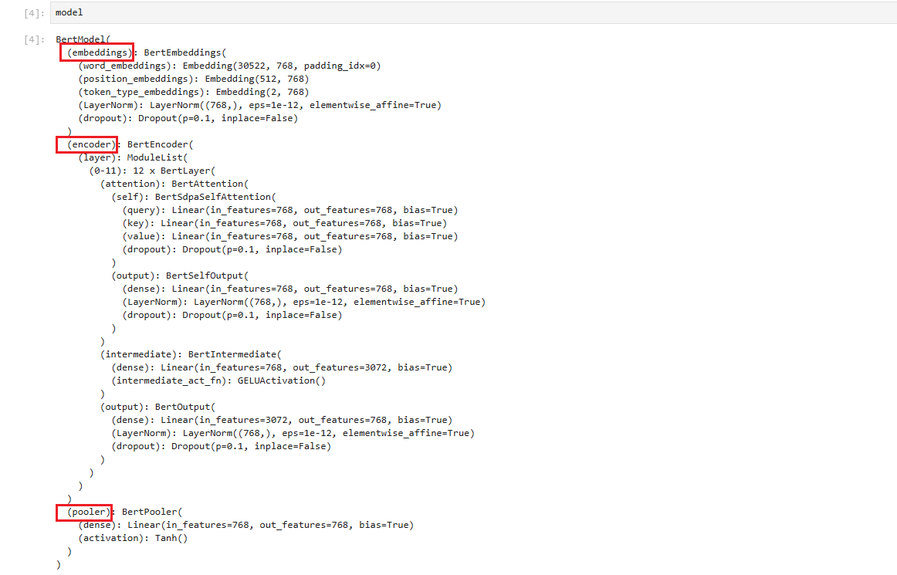
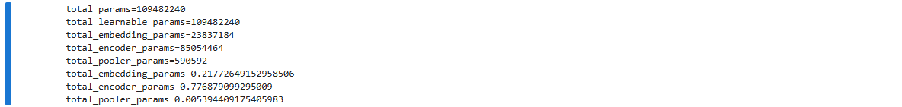

# transformers源码剖析

## 1.AutoTokenizer原理剖析

```python
tokenizer = AutoTokenizer.from_pretrained(MODEL_NAME, use_fast=False)
test_sentences = ["today is not that bad", "today is so bad"]
tokenizer(test_sentences, padding=True, return_tensors="pt")
```

#### 1.0 AutoTokenizer加载分词器

##### 参数：

- `use_fast`
  -  默认为`True`，是否使用基于 `tokenizers` 库的快速分词器。如果设置为 `False`，则加载基于 Python 实现的慢速分词器。如果模型不支持快速分词器，则无论此参数设置如何，都会使用慢速分词器。

- `cache_dir`
  - `str`，指定缓存目录，用于下载和存储模型或分词器。如果你想要将下载的分词器文件存储到自定义的目录，可以通过此参数设置缓存路径。
- `resume_download`
  - 类型`bool`，默认值为`False`，如果下载过程中发生中断，是否从中断点继续下载。
- `force_download`
  - 类型`bool`，默认值为`False`，是否强制重新下载分词器。即使分词器文件已经缓存，设置 `force_download=True` 也会重新下载并覆盖缓存文件。

- 如果tokenizer()传入的是一个batch , 则调用tokenizer.batch_encode_plus()
  -  tokenizer(test_sentences, padding=True, return_tensors="pt") => tokenizer.\_\_call\_\_() => tokenizer.batch_encode_plus()
- 如果tokenizer()传入的是一个句子，则调用tokenizer.encode_plus()
  -  tokenizer(test_sentences[0], padding=True, return_tensors="pt") => tokenizer.\_\_call\_\_() => tokenizer.encode_plus()

#### 1.1 tokenizer.batch_encode_plus()


如上图所示，`tokenizer.batch_encode_plus()`会直接调用到`class PreTrainedTokenizerFast`类中默认实现的`_batch_encode_plus()`，


`_batch_encode_plus()`方法里的`self._tokenizer.encode_batch()`方法，

在`self._tokenizer.encode_batch()`里执行了以下两步操作：

- ```python
  tokens = self.tokenize(text, **kwargs)
  ```

- ```python
  self.convert_tokens_to_ids(tokens)
  ```

而在`convert_tokens_to_ids(tokens)`里则继续调用：

```python
for token in tokens:
    self.vocab.get(token, self.vocab.get(self.unk_token))
```

然后：

```python
input_ids = self.vocab.get("[CLS]" self.vocab.get(self.unk_token)) + ids + self.vocab.get("[SEP]" self.vocab.get(self.unk_token))
```

#### 1.2 tokenizer.encode_plus()


如上图所示，`tokenizer.encode_plus()`会直接调用到`class PreTrainedTokenizerFast`类中默认实现的`_encode_plus()`，


在`_encode_plus()`方法里执行了以下两步操作：

- ```python
  tokens = self.tokenize(text, **kwargs)
  ```

- ```python
  self.convert_tokens_to_ids(tokens)
  ```

而在`convert_tokens_to_ids(tokens)`里则继续调用：

```python
for token in tokens:
    self.vocab.get(token, self.vocab.get(self.unk_token))
```

然后：

```python
input_ids = self.vocab.get("[CLS]" self.vocab.get(self.unk_token)) + ids + self.vocab.get("[SEP]" self.vocab.get(self.unk_token))
```

#### 1.3 padding的策略


```python
class PaddingStrategy(ExplicitEnum):
    """
    Possible values for the `padding` argument in [`PreTrainedTokenizerBase.__call__`]. Useful for tab-completion in an
    IDE.
    """

    LONGEST = "longest"
    MAX_LENGTH = "max_length"
    DO_NOT_PAD = "do_not_pad"
```

- `padding=True`使用的就是"longest"策略，即取出几个句子中最长的length作为最大长度。

- `padding="max_length"`要配合`max_length`参数来使用，然后打PAD为max_length长度。

#### 1.4 token_type_ids


```python
tokenizer(test_news, padding="max_length", truncation=True,max_length=32,return_tensors="pt")
```

执行的是batc_encode_plus()， 针对`test_news`里的每一句话进行分词，所以`token_type_ids`就是每个单独一句话都是0.



```python
tokenizer.encode_plus(text=test_news[0], text_pair=test_news[1], padding="max_length", truncation=True, max_length=32, return_tensors="pt")
```

而对于句子对进行输入时，`token_type_ids`就会表示第一句都是0，第二句都是1进行标识.

## 2. bert模型架构以及参数统计

#### 2.1 bert模型架构

使用`AutoModel`来加载`bert-base-uncased`预训练模型时：

```python
from transformers import AutoModel , AutoModelForSequenceClassification
model_name = "models/bert-base-uncased"
model = AutoModel.from_pretrained(model_name)
```



如上图所示，`model`包含`embeddings`、`encoder layers`、`pooler`三大部分组成.

- `embeddings`
  - 包含`word_embeddings`、`position_embeddings`、`token_type_embeddings`
- `encode part`
  - 12 * `BertLayer`
  - 只有`Transformer`的`Encoder`部分

#### 2.2 `AutoModel`加载的`bert-base-uncased`模型的参数统计

```python
# 计算参数量
total_params = 0
# 可学习的参数
total_learnable_params = 0
# embeddings 参数统计
total_embedding_params = 0
# encoder layers 参数统计
total_encoder_params = 0
# pooler 参数统计
total_pooler_params = 0

for name , param in model.named_parameters():
    total_params += param.numel()
    if param.requires_grad == True:
        total_learnable_params += param.numel()
    if "embedding" in name:
        total_embedding_params += param.numel()
    if "encoder" in name:
        total_encoder_params += param.numel()
    if "pooler" in name:
        total_pooler_params += param.numel()

print(f"{total_params=}")
print(f"{total_learnable_params=}")
print(f"{total_embedding_params=}")
print(f"{total_encoder_params=}")
print(f"{total_pooler_params=}")

# 计算占比
params = {"total_embedding_params" : total_embedding_params, "total_encoder_params": total_encoder_params , "total_pooler_params": total_pooler_params}
all_params_num = sum(params.values())
for name , param in params.items():
    print(name , param / all_params_num)
```




